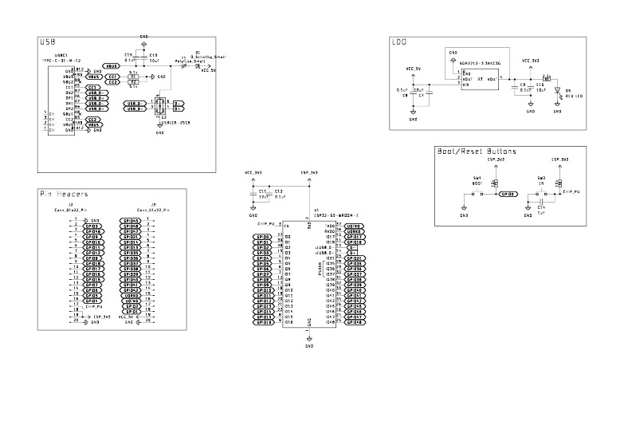

# ESP32 Breadboard Devboard

This project is an ESP32-S3-WROOM-1 devboard that can fit on a breadboard, unlike standard ESP32 DevKit V1s. I made it because my current ESP32s don't fit on a breadboard and it makes it really difficult to prototype easily, so this fixes that problem.

[Journal](JOURNAL.md)

## Images
Schematic: \
 

PCB: \
 

CAD (Back): \

[BOM](KiCad/esp32-breadboard-board/jlcpcb/production_files/BOM-esp32-breadboard-board.csv): \
